# Malacca AI Tour Guide

An AI-powered itinerary planning application designed to help tourists visiting Malacca City plan personalized daily travel itineraries. The app uses LangChain agents for dynamic itinerary generation and integrates state management via GetX in Flutter.

---

## Table of Contents

1. [Introduction](#introduction)
2. [Features](#features)
3. [Architecture Overview](#architecture-overview)
4. [LangChain Agent Workflow](#langchain-agent-workflow)
5. [Database Schema](#database-schema)
6. [Project Structure](#project-structure)
7. [Implementation Plan](#implementation-plan)
8. [Milestones](#milestones)
9. [Evaluation](#evaluation)

---

## Introduction

The **Malacca AI Tour Guide** app allows users to:

- Input trip details such as budget, duration, and preferences.
- Chat with an AI to receive personalized daily itineraries.
- Dynamically adjust their plans and view organized itineraries.

---

## Features

### Core Features:

1. User Authentication:

   - Local authentication using SQLite.
   - Signup/Login functionality.

2. Dynamic Itinerary Generation:

   - AI-powered recommendations for attractions and restaurants.
   - Suggestions tailored to user budget and trip duration.

3. Chat Interface:

   - Interactive chat to input preferences and receive itinerary updates.

4. Day-by-Day Itinerary View:

   - Users can view, edit, and finalize plans for each day of their trip.

5. Offline Data Access:
   - Cached data for offline viewing of itineraries.

---

## Architecture Overview

### Frontend and Backend:

- Built entirely in **Flutter**.
- State management via **GetX** for dynamic UI updates.

### LangChain Agent Logic:

- Modular agents implemented using `langchain_dart`:
  - **AttractionAgent**: Fetches attractions from Google Places API.
  - **RestaurantAgent**: Fetches dining options.
  - **BudgetFilterAgent**: Filters recommendations by budget.
  - **ItineraryAgent**: Organizes plans into daily itineraries.

### SQLite Database:

- Local storage using `sqflite` for:
  - User preferences and authentication.
  - Cached data for attractions and restaurants.
  - Hierarchical itinerary data (itinerary > days > places).

### Dependencies

    dependencies:
        flutter:
            sdk: flutter
        sqflite: ^2.4.1
        get: ^4.6.6
        langchain: ^0.7.7+2
        langchain_core: ^0.3.6+1
        langchain_openai: ^0.7.3
        flutter_dotenv: ^5.2.1

---

## LangChain Agent Workflow

The LangChain agents work together to deliver a personalized itinerary based on user input. Below is a detailed explanation of each agent's role and how they interact to produce the final result.

### 1. User Input Collection

- **Chat Interface**:
  - The user provides their trip preferences through the chat interface, including:
  - Budget (e.g., $300)
  - Duration (e.g., 3 days)
  - Additional preferences (e.g., type of cuisine, favorite activities).
  - The `ChatController` processes this input and sends it to the agents.

---

### 2. Data Fetching and Filtering Agents

The following agents fetch and filter relevant data:

#### a. AttractionAgent

- **Purpose**:
  - Fetch a list of tourist attractions in Malacca City.
- **Workflow**:
  1. Queries Google Places API with keywords like "tourist attractions in Malacca City."
  2. Retrieves details such as:
  - Attraction name
  - Description
  - Ratings
  - Estimated costs
  - Opening hours
  3. Returns a list of attractions to the `BudgetFilterAgent`.

#### b. RestaurantAgent

- **Purpose**:
  - Fetch a list of restaurants based on user preferences and location.
- **Workflow**:
  1. Queries APIs like Google Places or Yelp with parameters like:
  - Cuisine preference
  - Budget range
  - Location proximity
  2. Retrieves details such as:
  - Restaurant name
  - Average meal cost
  - Cuisine type
  - Ratings
  - Opening hours
  3. Sends this list to the `BudgetFilterAgent`.

#### c. BudgetFilterAgent

- **Purpose**:
  - Filter attractions and restaurants based on the user's budget.
- **Workflow**:
  1. Receives lists from `AttractionAgent` and `RestaurantAgent`.
  2. Filters results to exclude options outside the user's budget.
  3. Ranks the remaining options based on cost, rating, and relevance.
  4. Passes the filtered and ranked results to the `ItineraryAgent`.

---

### 3. Itinerary Generation and Optimization

#### a. ItineraryAgent

- **Purpose**:
  - Create a day-by-day plan based on filtered data.
- **Workflow**:
  1. Groups filtered attractions and restaurants into daily plans.
  2. Optimizes the itinerary by:
  - Minimizing travel time between locations (e.g., using Google Maps API for distance data).
  - Ensuring time slots align with opening hours.
  - Distributing the budget evenly across days.
  3. Generates a detailed itinerary for each day, including:
  - Places to visit
  - Suggested time slots
  - Estimated costs
  4. Returns the finalized itinerary to the app for display.

---

### 4. Display and User Interaction

- The generated itinerary is displayed on the **Itinerary Screen**.
- Users can:
  - View their full itinerary day by day.
  - Add or remove places manually.
  - Save the itinerary locally for offline access.

---

### Data Flow Diagram

```plantuml
@startuml
actor User
entity "ChatController" as Chat
entity "AttractionAgent" as Attraction
entity "RestaurantAgent" as Restaurant
entity "BudgetFilterAgent" as BudgetFilter
entity "ItineraryAgent" as Itinerary
database "SQLite Database" as SQLite

User -> Chat: Provide trip details
Chat -> Attraction: Request attractions
Chat -> Restaurant: Request restaurants
Attraction -> BudgetFilter: Send attraction list
Restaurant -> BudgetFilter: Send restaurant list
BudgetFilter -> Itinerary: Send filtered results
Itinerary -> SQLite: Save finalized itinerary
SQLite -> Chat: Retrieve saved itinerary
Chat -> User: Display final itinerary
@enduml

## Database Schema

### Users Table
| Column          | Type    | Description                |
|----------------|---------|----------------------------|
| id             | INTEGER | Primary Key                |
| email          | TEXT    | User email (unique)        |
| password       | TEXT    | User password              |
| name           | TEXT    | User's name                |


### Itineraries Table
| Column       | Type    | Description                    |
|-------------|---------|--------------------------------|
| id          | INTEGER | Primary Key                    |
| user_id     | INTEGER | Foreign Key to Users Table     |
| title       | TEXT    | Name of the itinerary          |
| start_date  | TEXT    | Start date of the trip         |
| end_date    | TEXT    | End date of the trip           |
| total_budget | INTEGER | Total budget for the trip      |
| preferences | TEXT    | Itinerary preferences (JSON)   |
| status      | TEXT    | Status of itinerary (default: 'draft') |

### DayItineraries Table
| Column       | Type    | Description                      |
|-------------|---------|----------------------------------|
| id          | INTEGER | Primary Key                      |
| itinerary_id | INTEGER | Foreign Key to Itineraries Table |
| date        | TEXT    | Date for the day's itinerary     |
| total_cost  | INTEGER | Total cost for the day's plan    |
| status      | TEXT    | Status of day (default: 'planned')|
| weather_info | TEXT    | Weather information (JSON)        |

### PlaceItineraries Table
| Column           | Type    | Description                        |
|-----------------|---------|-----------------------------------|
| id              | INTEGER | Primary Key                        |
| day_itinerary_id | INTEGER | Foreign Key to DayItineraries Table|
| place_name      | TEXT    | Name of the place                  |
| place_type      | TEXT    | Type: Attraction/Restaurant        |
| cost            | INTEGER | Estimated cost                     |
| time            | TEXT    | Time allocated for the place       |
| notes           | TEXT    | Additional notes                   |
| address         | TEXT    | Place address                      |
| rating          | REAL    | Place rating                       |
| image_url       | TEXT    | URL of place image                 |
| place_details   | TEXT    | Additional details (JSON)          |
| opening_hours   | TEXT    | Opening hours info (JSON)          |
| duration        | TEXT    | Duration of visit (JSON)           |
| location        | TEXT    | Location coordinates (JSON)        |


Key Updates:
1. Added `duration` field to PlaceItineraries table
2. Added unique constraint on (day_itinerary_id, place_name) in PlaceItineraries
3. All JSON fields now have default value of '{}'
4. Proper foreign key constraints added
5. Added indices for better query performance


This schema supports:
- User authentication and preferences
- Multi-day itinerary planning
- Place details with location data
- Weather information integration
- Unique place entries per day
- Proper relationship management between entities

## Project Structure

malacca_ai_tour_guide/
├── lib/
│   ├── main.dart               	# Entry point for the Flutter app
│   ├── features/               	# Feature-specific folders
│   │   ├── welcome/            	# Welcome screen feature
│   │   │   ├── view/           	# UI-related files for Welcome
│   │   │   │   ├── welcome_view.dart # Main widget for Welcome screen
│   │   │   ├── widgets/        	# Reusable widgets for Welcome
│   │   │   │   ├── welcome_button.dart
│   │   ├── login/              	# Login/Signup screen feature
│   │   │   ├── view/
│   │   │   │   ├── login_view.dart
│   │   │   ├── widgets/
│   │   │   │   ├── login_form.dart
│   │   ├── home/               	# Home screen feature
│   │   │   ├── view/
│   │   │   │   ├── home_view.dart
│   │   ├── chat/               	# Chat screen feature
│   │   │   ├── view/
│   │   │   │   ├── chat_view.dart
│   │   │   ├── widgets/
│   │   │   │   ├── chat_bubble.dart
│   │   │   │   ├── itinerary_card.dart  # Card for displaying itinerary suggestions
│   │   ├── itinerary/          	# Itinerary screen feature
│   │   │   ├── view/
│   │   │   │   ├── itinerary_view.dart
│   │   │   ├── widgets/
│   │   │   │   ├── itinerary_card.dart
│   ├── controllers/            	# Contains GetX controllers for state management
│   │   ├── chat_controller.dart	# Manages chat interactions and data flow
│   │   ├── itinerary_controller.dart # Manages itineraries and day plans
│   │   ├── user_controller.dart 	# Manages user authentication and preferences
│   ├── database/               	# SQLite database setup and access
│   │   ├── base/
│   │   │   ├── database_helper.dart
│   │   ├── crud/
│   │   │   ├── users_crud.dart
│   │   │   ├── itineraries_crud.dart
│   │   │   ├── day_itineraries_crud.dart
│   │   │   ├── place_itineraries_crud.dart
│   ├── models/                 	# Data models for app entities
│   │   ├── chat_message_model.dart # Chat message model
│   │   ├── chat_response_model.dart  # Model for structured chat responses
│   │   ├── day_itinerary_model.dart # Day itinerary model
│   │   ├── itinerary_model.dart 	# Itinerary model
│   │   ├── place_itinerary_model.dart # Place (attractions/restaurants) model
│   │   ├── user_model.dart # User model
│   │   ├── place_model.dart # Place model
│   │   ├── place_visit_model.dart # Place visit model
│   │   ├── transportation_details_model.dart # Transportation details model
│   │   ├── weather_info_model.dart # Weather info model
│   ├── agents/                 	# LangChain agent logic
│   │   ├── attraction_agent.dart	# Handles fetching attractions
│   │   ├── restaurant_agent.dart	# Handles fetching restaurants
│   │   ├── budget_filter_agent.dart # Filters recommendations by budget
│   │   ├── itinerary_agent.dart 	# Generates optimized daily itineraries
│   ├── utils/                  	# Helper functions and constants
│   │   ├── constants.dart       	# App-wide constants (e.g., API keys, strings)
│   │   ├── api_helper.dart      	# Helper functions for API requests
│   │   ├── place_images.dart     # Helper for fetching place images
│   ├── config/                 	# Configuration files
│   │   ├── app_colors.dart    	# App color palette and theme colors
│   │   ├── app_constants.dart    # App-wide constants
│   │   ├── app_theme.dart      	# App-wide theming configuration
│   │   ├── dependencies.dart   	# GetX dependency injection setup
│   │   ├── env.dart           	# Environment variables configuration
│   ├── routes/                 	# Routes for navigation
│   │   ├── app_pages.dart       	# Define app routes and bindings
│   ├── main.dart               	# Entry point for the Flutter app


├── pubspec.yaml                	# Project dependencies
├── README.md                   	# Project description and setup instructions


## Implementation Status

### Completed
- Basic chat interface
- LangChain integration
- Local database setup
- Authentication system
- Basic itinerary management

### In Progress
- Leaflet map integration
- Location-based services
- Route visualization
- Place uniqueness in database
- Itinerary updates within date range

### Planned
- Weather integration
- Offline map support
- Enhanced restaurant recommendations
- Budget optimization
- Multi-language support


```

